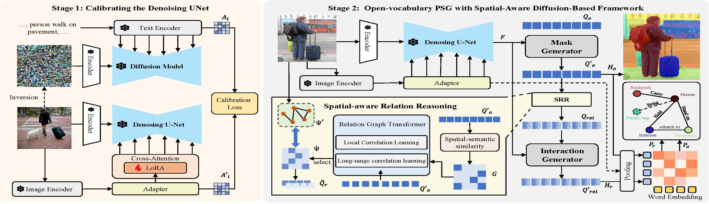

## Abstract

>Panoptic Scene Graph Generation (PSG) integrates instance segmentation with relation understanding to capture pixel-level structural relationships in complex scenes. Although recent approaches leveraging pre-trained vision-language models (VLMs) have significantly improved performance in the open-vocabulary setting, they commonly ignore the  inherent limitations of VLMs in spatial relation reasoning, which results in suboptimal relation prediction. Motivated by the denoising diffusion implicit model's inversion process in preserving the spatial structure of input images, we propose SPADE (SPatial-Aware Denoising-nEtwork) framework---a novel approach for open-vocabulary PSG. SPADE consists of two key steps: (1) inversion-guided calibration for the UNet adaption, and (2) spatial-aware context reasoning. In the first step, we calibrate a general pre-trained teacher diffusion model into a PSG-specific denoising network with cross-attention maps derived during inversion through a lightweight LoRA-based fine-tuning strategy. In the second step, we develop a spatial-aware relation graph transformer that captures both local and long-range contextual information, facilitating the generation of high-quality relation queries. Extensive experiments on benchmark PSG and Visual Genome datasets demonstrate that SPADE outperforms state-of-the-art methods in both closed-set and open-set scenarios, particularly excelling in spatial relationship prediction.

## Overview

SPADE is a novel two-stage framework for **Panoptic Scene Graph Generation (PSG)** that unifies instance segmentation with relation reasoning to capture rich pixel-level structural relationships in complex scenes. Unlike conventional Vision-Language Models (VLMs) that often struggle with spatial relation prediction, SPADE leverages the strengths of diffusion models. In particular, our approach calibrates a pre-trained diffusion model via its inversion process—using cross-attention maps and a lightweight LoRA-based fine-tuning strategy—to inject spatial and relational knowledge into the denoising UNet. A spatial-aware relation graph transformer then further refines the relation queries by capturing both local and long-range contextual dependencies.

## Key Features

- **Inversion-Guided Calibration:** Transforms a pre-trained diffusion model into a PSG-specific denoising network by exploiting the spatial information preserved during the inversion process.
- **Spatial-Aware Relation Reasoning:** Uses a graph transformer to integrate local cues and long-range context, enabling robust spatial relation prediction.
- **Open-Vocabulary Generalization:** Successfully recognizes unseen objects and relationships, addressing the limitations of general-purpose LLMs in spatial reasoning.
- **Superior Performance:** SPADE achieves state-of-the-art results on both closed-set and open-set PSG benchmarks.

