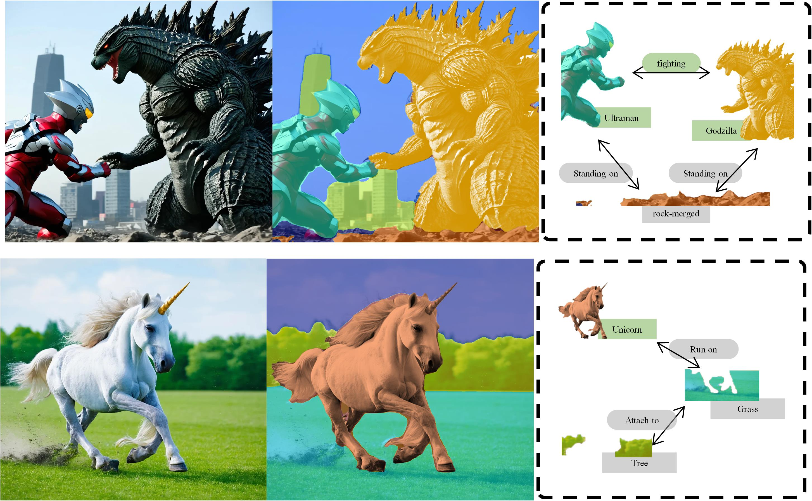

## Abstract

>Panoptic Scene Graph Generation (PSG) combines panoptic segmentation and scene graph generation to provide a holistic understanding of visual scenes. With the remarkable advances in large multimodal models (LMMs), recent PSG research has increasingly focused on generating open-world panoptic scene graphs in the wild. However, current open-world PSG models typically suffer from three limitations: i) limited object and predicate categories for the open-world PSG training and evaluation; ii) difficulty in predicting spatially-related predicates; and iii) insufficient exploration of relatedness contexts. To address these limitations, we first curate a new dataset OW-PSG that is specifically designed for open-set PSG evaluation. We then propose the Relation Diffusion RelDiff model for open-world Panoptic Scene Graph Generation, which combines a diffusion model and a large multimodal model (LMM) by fine-tuning a denoising network with a lightweight LoRA technique. Moreover, we develop a Relation Graph Transformer to capture comprehensive contextual information built upon a  spatial and semantic graph. Last, we evaluate our model on the benchmark PSG, VG,  and our proposed OW-PSG dataset. Across the board, RelDiff demonstrates RelDiff's superior generalization capabilities and achieves state-of-the-art performance in the open-world setting.

## Challenges in Generalizing Beyond Predefined Categories
Current datasets are constrained by predefined object and relationship categories, limiting the generalization ability of trained models to unseen scenarios. These models struggle to predict diverse and imaginative relationships and instances that extend beyond traditional categories. For example, while current datasets include common objects such as “Tie” or “Chair,” they lack broader concepts like mythical creatures (e.g., “Dragon,” “Mermaid”) or fantastical relationships envisioned by human imagination.

## Open-World Visual Understanding
Our RelDiff model has the remarkable ability to transcend the limitations of traditional dataset categories to accurately predict relationships and instances in highly imaginative scenarios. The figures underscore the strength of RelDiff in handling open-world scenarios.  By leveraging the powerful combination of diffusion models and LMMs, the model achieves a nuanced understanding of both realistic and fantastical scenes.

